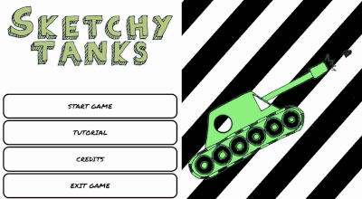

# game-development
This repo contains all my experiments with game development AND visual simulation AND animation with various engines
All the Game Executables are in the `/doc` folder

# Sketchy Tanks
Completed on **18th Feb 2025**. Very proud of it! It's in the folder `sketchy-tanks`. Made completely in Godot 4.3. All assets are hand-drawn. Took **5 months** of developing in my spare time, after work, on weekends. **Wow! It's finally done**

